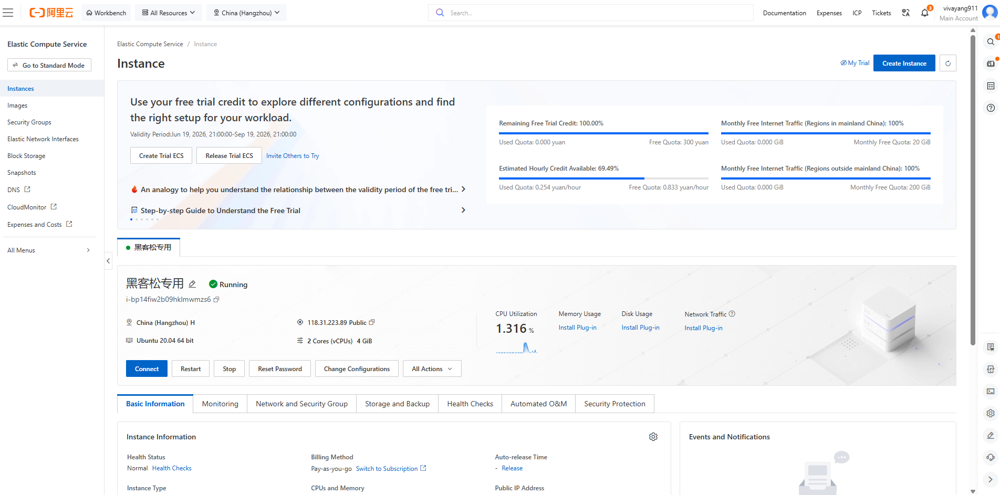
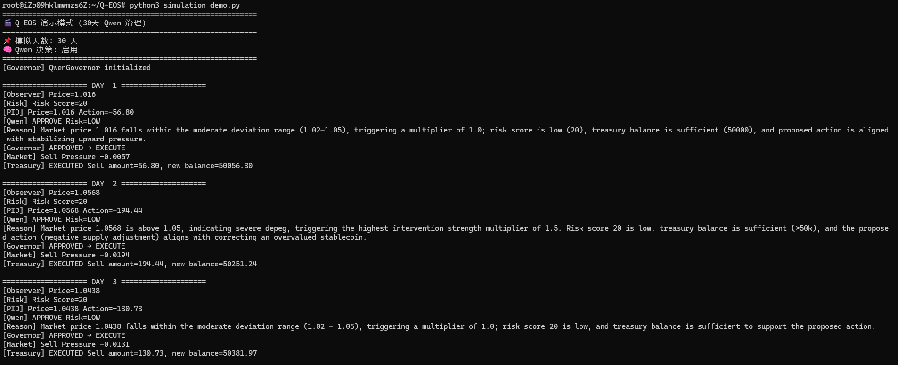

# Alibaba Cloud Deployment Proof
# 阿里云部署证明

## Deployment Environment / 部署环境
- **Platform / 平台**: Alibaba Cloud ECS / 阿里云云服务器
- **Instance Type / 实例规格**: ecs.e-c1m2.large (2 vCPU, 4 GiB Memory / 2核4G)
- **OS / 操作系统**: Ubuntu 20.04 LTS
- **Region / 地域**: China (Hangzhou) / 中国（杭州）
- **Public IP / 公网IP**: 118.31.223.89
- **Instance Name / 实例名称**: 黑客松专用

---

## Qwen API Integration / Qwen API 集成
- **API Key**: Set via environment variable `DASHSCOPE_API_KEY` / 通过环境变量 `DASHSCOPE_API_KEY` 设置
- **SDK**: dashscope
- **Model / 模型**: qwen-plus
- **API Calls / API 调用**: Successful with `[Qwen] APPROVE` responses / 成功，返回 `[Qwen] APPROVE` 响应

---

## Verification / 验证结果
- 30-day simulation completed successfully / 30天模拟成功完成
- Qwen API calls confirmed with `[Qwen] APPROVE` logs / Qwen API 调用已通过 `[Qwen] APPROVE` 日志确认
- System running on Alibaba Cloud infrastructure / 系统运行在阿里云基础设施上

---

## Screenshots / 截图证明
- ECS Console / ECS 控制台: 
- Terminal Log (Qwen API calls) / 终端日志（Qwen API 调用）: 

---

## Test Commands / 测试命令
```bash
# Clone and run / 克隆并运行
git clone https://github.com/vivayang911/Q-EOS.git
cd Q-EOS
export DASHSCOPE_API_KEY="your-api-key"
python3 simulation_demo.py
```

June 19, 2026 / 2026年6月19日

