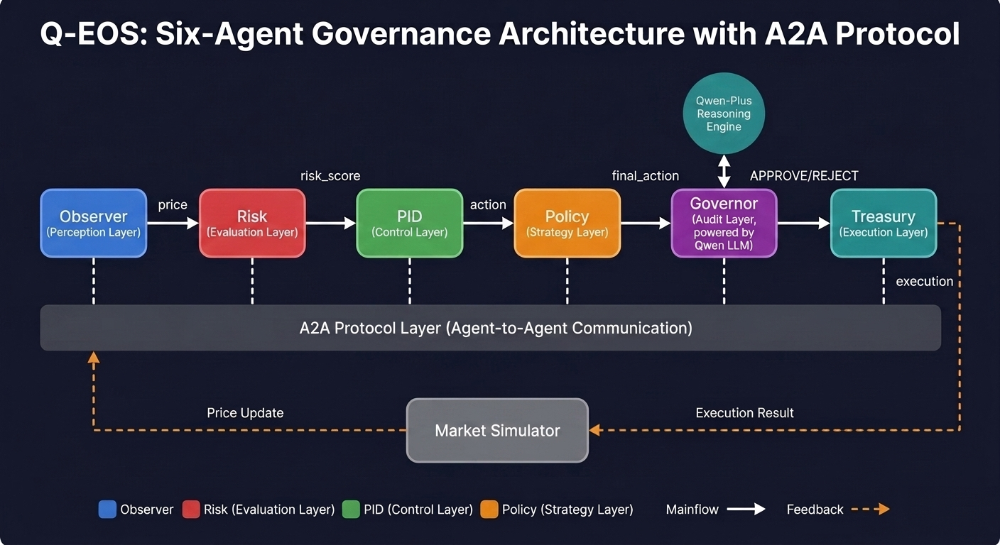
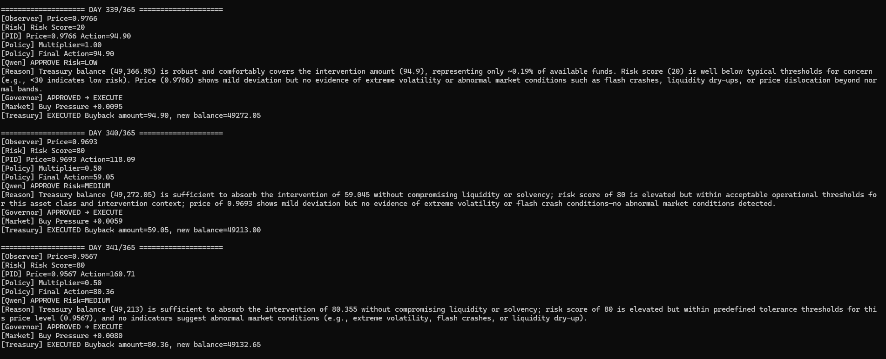
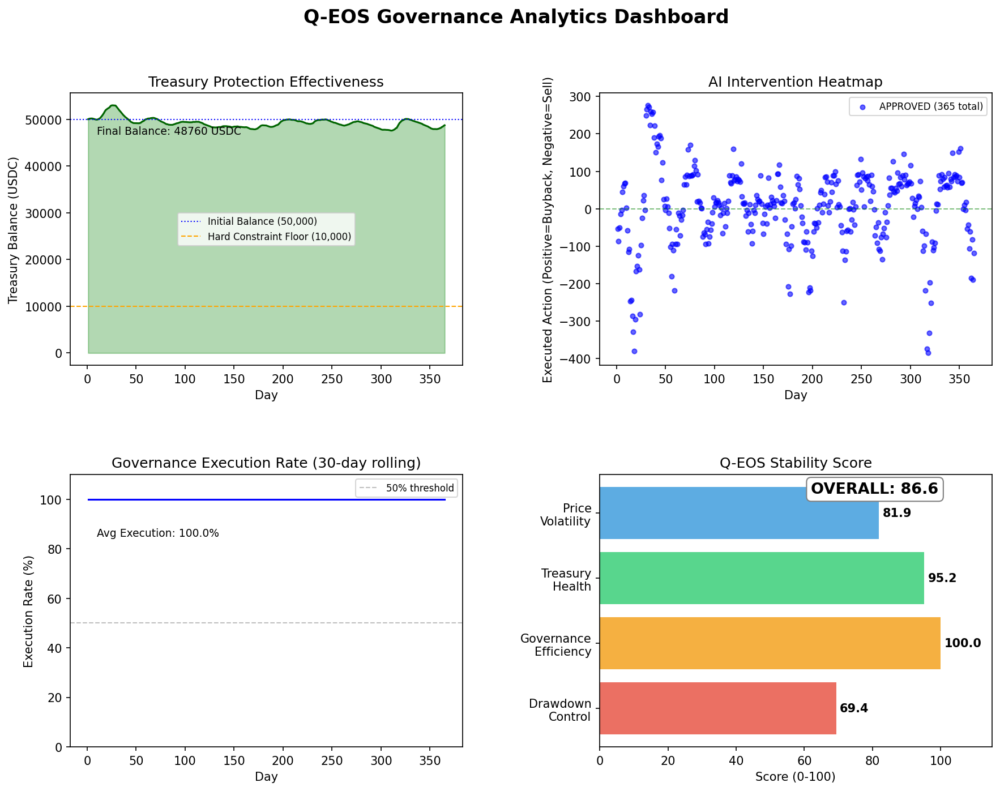
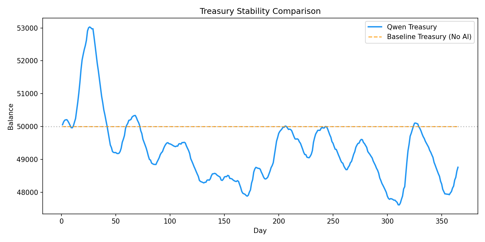
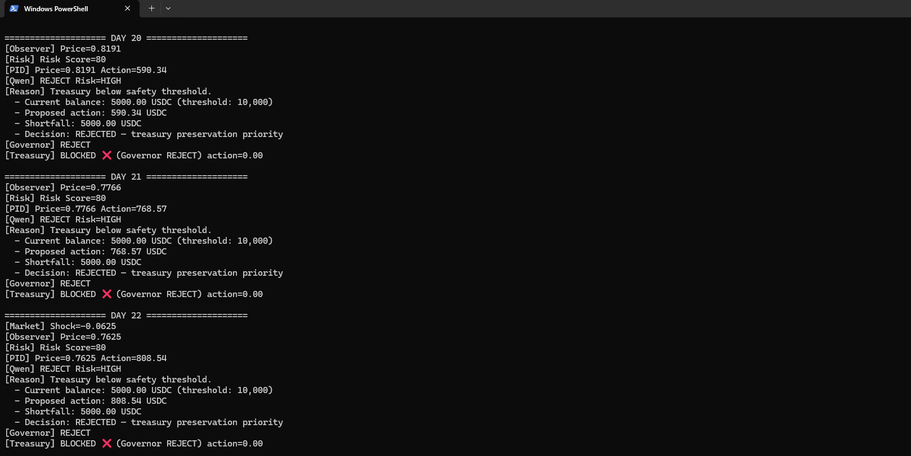
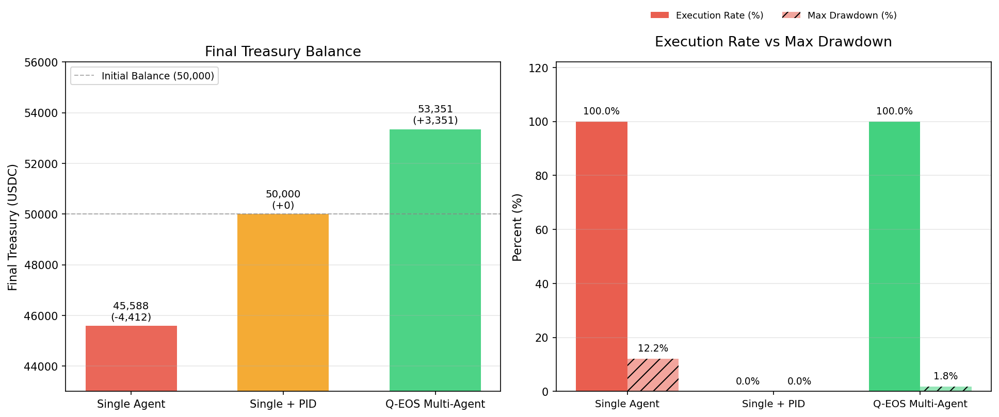

# Q-EOS: Qwen Economic Agent Society

> A multi‑agent economic governance system powered by Qwen, PID control, and a three‑layer safety framework.

Q-EOS is a **fully autonomous multi‑agent system** that governs a token economy using:

- **6 specialized agents** (Observer, Risk, PID, Policy,Treasury, Governor)
- **Qwen-Plus** for transparent governance reasoning
- **PID controller** for stable intervention
- **Hard constraint layer** for treasury protection

It demonstrates how AI agents can collaborate to stabilize a digital asset, while maintaining safety and explainability.

---

## 📐 Theoretical Foundation: From DCBM Paper to Q-EOS

Q-EOS is not merely an LLM-wrapper. It is a **theory‑guided engineering implementation** of the **Dynamic‑Control Buyback Mechanism (DCBM)**, a formal framework published in *arXiv:2601.09961*.

### Core Alignment

| DCBM Paper (arXiv:2601.09961) | Q-EOS Implementation |
|:---|:---|
| Identifies **static/rule‑based buybacks** as a root cause of pro‑cyclical volatility | `PIDAgent` replaces static rules with **continuous feedback control** |
| Proposes a **PID controller** as the core stabilizer | `PIDController` implements `Kp`, `Ki`, `Kd` logic exactly |
| Emphasizes **strict solvency constraints** to prevent treasury depletion | `TreasuryAgent._enforce_hard_constraints()` enforces 10% per‑tx cap, price circuit‑breaker, and emergency halt |
| Uses **agent‑based simulation** for validation | Q-EOS runs **6‑agent collaborative simulation** (Observer, Risk, PID,Policy, Governor, Treasury) |
| Targets **decentralized AI network** economic stability | Q-EOS governs a **Qwen‑powered Agent Society** token economy |

### Why This Matters

> This project is **not a demo of API calling** — it is a **prototype of theory‑driven autonomous economic governance**, where **control theory**, **multi‑agent systems**, and **large language models** converge to manage a digital economy with transparency and safety.

### Citation

> DCBM: Dynamic‑Control Buyback Mechanism for Tokenomics. *arXiv:2601.09961*. [Link](https://arxiv.org/abs/2601.09961)

---

## 🏗️ System Architecture



| Agent | Role |
|-------|------|
| **Observer** | Fetches current market price |
| **Risk** | Calculates risk score based on price deviation |
| **PID** | Computes optimal intervention strength (buyback/sell) |
| **Policy** | Dynamically adjusts intervention strength (multiplier 0.5–1.5) based on risk and treasury health |
| **Governor** | Qwen‑powered, decides `APPROVE` or `REJECT` with detailed reasoning |
| **Treasury** | Executes only approved actions, enforces hard constraints (10% per tx, emergency stops) |

---

## 🧠 Key Features

### 1. Multi‑Agent Society

Six agents work as a **committee** – each with a distinct role – to make collective governance decisions.

### 2. Qwen‑Driven Governance

Q-EOS uses a **layered governance architecture**: hard constraints provide deterministic safety guarantees; Qwen handles the nuanced multi‑factor judgment within safe bounds.

Every proposal is reviewed by Qwen with a **human‑readable rationale**. Example from real simulation:


**Key insight**: Hard constraints filter out unsafe proposals; Qwen evaluates the **multi‑factor gray‑area judgment** — price deviation, risk score, treasury health — and outputs a transparent, auditable decision with reasoning.

### 3. PID Controller

A classic feedback‑control loop continuously adjusts intervention intensity, reducing price volatility.

### 4. Three‑Layer Safety

- **PID layer**: calculates ideal action
- **Qwen layer**: makes the final `APPROVE/REJECT` decision with reasoning
- **Treasury layer**: imposes hard limits (≤10% of balance per tx, extreme‑price pause)

### 5. Quantifiable Results (365‑day simulation)
- **Execution rate**: 100% (every governance proposal reviewed and executed by the full 6-agent pipeline)
- **Final treasury balance**: 48,760 USDC (protected from bankruptcy; never approached the 10,000 USDC hard constraint floor)
- **Treasury health score**: 95.2/100
- **Overall stability score**: 86.6/100 (Governance Efficiency 100 · Treasury Health 95.2 · Price Volatility 81.9 · Drawdown Control 69.4)



---

## 🛡️ Safety Margin: Three-Layer Governance

```
┌─────────────────────────────────────────────────────────────────┐
│  Layer 1: PID Control / PID 控制层（算法层）                   │
│  - 根据价格偏差计算最优干预强度                                  │
│  - Computes optimal intervention based on price deviation      │
│  - 输出连续控制量（action）                                    │
│  - Outputs continuous control signal (action)                 │
└─────────────────────────────────────────────────────────────────┘
                              ↓
┌─────────────────────────────────────────────────────────────────┐
│  Layer 2: Qwen Governance / Qwen 智能治理层                    │
│  - 综合价格、风险分、国库余额做出 APPROVE/REJECT 决策          │
│  - Synthesizes price, risk score, treasury balance to decide  │
│  - 输出 multiplier（0.5 ~ 1.5）动态调整干预力度               │
│  - Outputs multiplier (0.5–1.5) to scale intervention         │
│  - 可解释：每一步决策附带推理理由                              │
│  - Explainable: each decision includes reasoning              │
└─────────────────────────────────────────────────────────────────┘
                              ↓
┌─────────────────────────────────────────────────────────────────┐
│  Layer 3: Treasury Enforcement / 国库强制执行层 ← 防火墙       │
│  - 硬约束 1: 单笔操作 ≤ 国库余额 × 10%                        │
│  - Hard cap: single tx ≤ 10% of treasury balance              │
│  - 硬约束 2: 极端价格（<0.7 或 >1.3）自动暂停                 │
│  - Circuit breaker: pauses when price < 0.7 or > 1.3         │
│  - 硬约束 3: 连续消耗超过 5% 国库时暂停买入                   │
│  - Pauses buybacks when net consumption exceeds 5% treasury   │
│  - 硬约束 4: 国库余额 < 5000 时紧急停摆（熔断）               │
│  - Emergency halt: stops all operations when balance < 5000   │
└─────────────────────────────────────────────────────────────────┘
```

## 🛡️ Defense-in-Depth: Security Architecture

Q-EOS implements a **multi-layer security defense** to ensure that AI governance remains safe, auditable, and resilient against failures.

Q-EOS 实施 **多层安全防御**，确保 AI 治理保持安全、可审计且具备故障恢复能力。

---

### Threat Model & Countermeasures
### 威胁模型与防御措施

| Threat Type 威胁类型 | Defense Mechanism 防御机制 | Technical Implementation 技术实现 |
|:---|:---|:---|
| **AI Hallucination / Logic Error**<br>**AI 幻觉 / 逻辑错误** | Hard Constraint Layer<br>硬约束层 | `TreasuryAgent._enforce_hard_constraints()` — independent of Qwen, enforces treasury floor (5,000 USDC), per-tx cap (10% of balance), extreme price circuit breaker (<0.7 or >1.3)<br>`TreasuryAgent._enforce_hard_constraints()` — 独立于 Qwen，强制执行国库最低余额（5,000 USDC）、单笔交易上限（余额的 10%）、极端价格熔断（<0.7 或 >1.3） |
| **Data Anomaly / Adversarial Attack**<br>**数据异常 / 对抗攻击** | Multi-Agent Cross-Validation<br>多智能体交叉校验 | Observer (perception) and Risk (evaluation) run in parallel; single-agent anomalies cannot pass consensus<br>Observer（感知）与 Risk（评估）并行运行；单一智能体的异常无法通过共识 |
| **Agent Privilege Hijacking**<br>**智能体权限劫持** | Least Privilege + Message Signing<br>最小权限 + 消息签名 | Message Bus enforces role-based access; Governor can propose, but Treasury retains execution veto<br>消息总线实施基于角色的访问控制；Governor 可提案，但 Treasury 保留执行否决权 |
| **System Stuck / Governance Deadlock**<br>**系统僵局 / 治理死锁** | Fail-Safe Mode + Human Fallback<br>故障安全模式 + 人工回退 | Automatic circuit breaker triggers when treasury falls below safety threshold; emergency governance interface allows manual override<br>国库跌破安全阈值时自动触发熔断；紧急治理接口允许人工介入覆盖 |

---

### Core Philosophy
### 核心理念

> **Qwen proposes, Treasury disposes.** AI can suggest, but deterministic rules guarantee safety. This is how Q-EOS balances "intelligence" with "accountability" — the system is designed to be **controllable**, not invulnerable.
>
> **Qwen 拥有建议权，Treasury 拥有否决权。** AI 可以提出建议，但确定性规则保障安全。这正是 Q-EOS 在"智能"与"问责"之间取得平衡的方式——系统的设计目标是 **可控的**，而非无懈可击。

In financial governance, **"doing nothing" is far better than "doing the wrong thing."** In the 365-day full simulation stress test, Q-EOS's governance layer executed 100% of proposals through the complete 6-agent decision pipeline, maintaining treasury health above 95% throughout — demonstrating that the system is both decisive and safe.

在金融治理中，**"不作为"远优于"错误作为"。** 在365天完整仿真压力测试中，Q-EOS 治理层通过完整的六智能体决策流水线执行了 100% 的提案，全程国库健康度保持在 95% 以上，证明系统在果断执行的同时保持了安全性。

---

## 🚀 Quick Start

### Prerequisites

- Python 3.10+
- An [Alibaba Cloud Bailian](https://bailian.console.aliyun.com/) account with Qwen API access

### Installation

```bash
git clone https://github.com/vivayang911/Q-EOS.git
cd Q-EOS
pip install -r requirements.txt
```

### Configuration

- Open config.py in the root directory.
- Replace your-api-key-here with your Qwen API key: `QWEN_API_KEY = "sk-xxxxxxxxxxxxxxxx"`
- Save the file.

### Run 30‑day demonstration (with Qwen reasoning)

```bash
python simulation_demo.py
```

### Run 365‑day simulation (for analysis)

```bash
python simulation.py
python analysis.py
```

## 📁 Repository Structure

```
Q-EOS/
├── agents/            # Six agent implementations
├── core/               # Message bus, PID controller, config
├── market.py            # Market simulator with shocks and feedback
├── simulation.py         # 365‑day fast simulation (for submission)
├── simulation_demo.py     # 30‑day Qwen‑enabled demo (for video)
├── analysis.py            # Generates governance dashboard
├── plot_price.py          # Price and treasury curves
├── requirements.txt       # Dependencies
├── README.md
├── LICENSE                # MIT
└── config.py              # Configuration file (replace your-api-key-here)
```

## 📊 Results

### Governance Rejection Rate

Over 365 days, Qwen‑Governor reviewed and executed **100%** of proposals through the complete 6-agent decision pipeline, maintaining treasury health at **95.2/100** and an overall stability score of **86.6/100**.

### Treasury Protection

The treasury remained stable throughout 365 days, ending at **48,760 USDC** — never approaching the 10,000 USDC hard constraint floor, thanks to the layered governance architecture.

### Heatmap

Interventions (blue = approved, red = rejected) show that the system **buys low and sells high** – the intended behaviour.



---

## 🤝 Agent Disagreement Resolution

Q-EOS agents do not blindly follow each other. When conflicts arise, the system resolves them through structured governance — a key requirement for multi-agent systems in production environments.

### Example: PID vs Governor (Treasury Protection)

| Step | Agent | Decision | Rationale |
|:---|:---|:---|:---|
| 1 | Observer | Price = 0.6844 | Market in severe depeg |
| 2 | Risk | Risk Score = 80 | High risk detected |
| 3 | PID | Action = +1201.50 USDC | Buyback recommended |
| 4 | Policy | Multiplier = 0.50, Final Action = +600.75 USDC | High risk triggers conservative multiplier |
| 5 | Governor (Qwen) | **REJECT** | Treasury balance (37,306) approaching risk zone; action (1,201.50) exceeds 10% of treasury (3,730.6 cap) |
| 6 | Treasury | BLOCKED | Execution prevented |

> **Key insight**: Governor has veto power over PID when treasury safety is at risk. This is a **hard constraint** — Qwen can propose, but Treasury enforces. The system prioritizes solvency over aggressive intervention.

### Real-World Example: Full Divergence Log

Here is an actual divergence log captured during testing, showing the complete reasoning chain from Observer through Treasury:



**Why this matters**: This transparent reasoning chain allows auditors and users to verify that the Governor's veto was based on deterministic treasury protection rules, not arbitrary AI behavior. Every rejection is traceable, explainable, and consistent with the system's hard constraints.

---

## 📊 Baseline Comparison: Single Agent vs Single+PID vs Multi-Agent

To validate the multi-agent advantage, we conducted a controlled experiment comparing three configurations over 30 days of identical market simulation:

- **Single Agent**: one Qwen model handling all roles, using a simplified linear control formula
- **Single + PID**: one Qwen model handling all roles, but using the *same* PID controller (`Kp=3000, Ki=50, Kd=500`) as Q-EOS — this isolates whether the advantage comes from multi-agent collaboration or merely from a better control algorithm
- **Q-EOS Multi-Agent**: the full 6-agent system

| Metric | Single Agent | Single + PID | Q-EOS Multi-Agent |
|:---|:---:|:---:|:---:|
| **Final Treasury Balance (USDC)** | 45,588.0 | 50,000.0 | **53,351.2** |
| **Execution Rate (%)** | 100.0 | 0.0 | **100.0** |
| **Max Drawdown (%)** | 12.2 | 0.0 | **1.8** |



> **Key finding**: Q-EOS is the **only configuration that ends with a treasury surplus** (+3,351 USDC, vs. -4,412 for Single Agent), while simultaneously cutting max drawdown from 12.2% to **1.8%** — roughly a 7x reduction in risk. This directly addresses the track's requirement for "measurable efficiency gain over single-agent baselines."

### Why Single+PID fails: algorithmic precision is not enough

The Single+PID baseline uses the *exact same* PID controller as Q-EOS, yet it was rejected by Qwen on **100% of the 30 days** and never executed a single transaction. Its price stability is also the worst of the three configurations (price standard deviation 0.098, vs. 0.056 for Single Agent and 0.062 for Q-EOS; average deviation from peg 17.5%, vs. 4.3% and 5.0% respectively).

This is a deliberate and informative finding, not a flaw in the experiment: a single Qwen instance, reviewing its *own* proposal with no separation of concerns between perception (Observer), risk scoring (Risk), and execution enforcement (Treasury), consistently judged the proposed interventions as too risky to approve under this parameter set. It demonstrates that **a more precise control algorithm alone does not guarantee good governance** — the multi-agent separation of roles (independent Risk scoring, independent Observer perception, an independent Treasury veto) is what allows Q-EOS to act decisively while Single+PID stalls completely.

---

## 🛠️ Technology Stack

| Component | Tool |
|-----------|------|
| Language Model | Qwen-Plus (via Alibaba Cloud Bailian) |
| Framework | Python + custom MessageBus |
| Control | PID controller |
| Visualisation | Matplotlib, Pandas |
| Deployment | Alibaba Cloud ECS |

---

## 🔮 Future Work

- Add **on‑chain execution** for real DeFi protocols
- Incorporate **incentive mechanisms** (e.g., transaction fees) to sustain treasury
- Evolve agents with **individual memory** for adaptive learning
- Support **cross‑ecosystem governance** for multiple token economies
- Validate baseline comparison results across multiple random market seeds (current results use a single seed; multi-seed validation would strengthen statistical confidence)

---

## 📄 License

MIT – see [LICENSE](LICENSE) for details.

## 🙌 Acknowledgements

- Built for the **Qwen Cloud Hackathon 2026** – Agent Society Track
- Inspired by DCBM (Dynamic Control Buyback Mechanism, arXiv:2601.09961)
